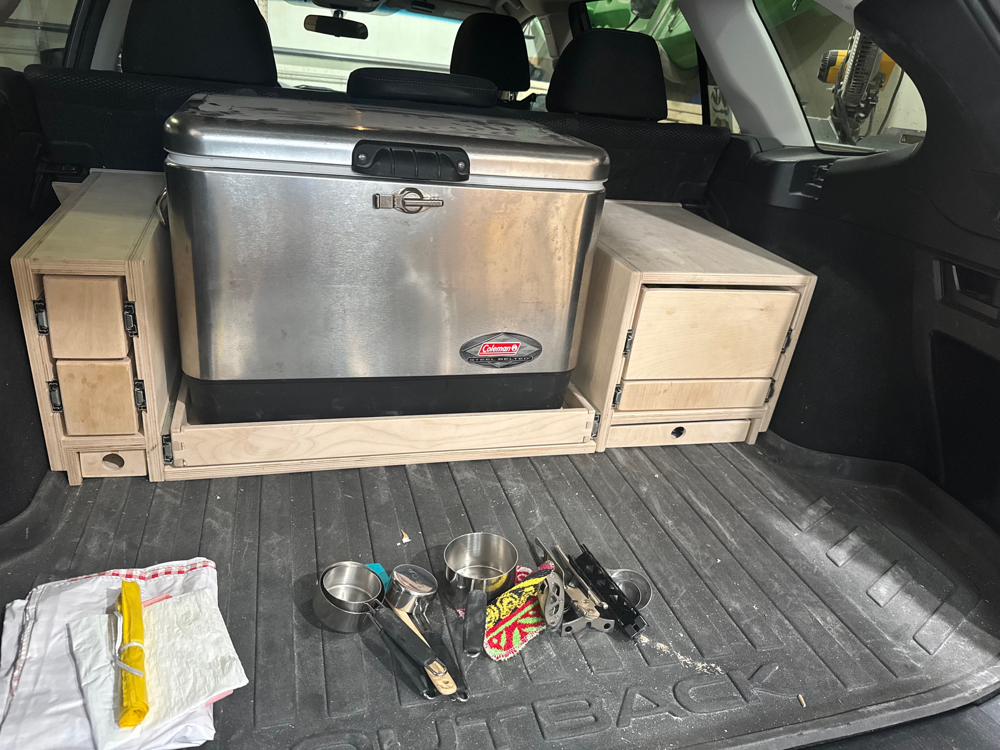

For essentially as long as we've had our Outback I've thought about building something that fits nicely into the back to make our camping setup more organized and just how we need it.  We've had a very similar setup for that entire time that is comprised for four things:

1. Our Coleman stainless steel cooler,
2. Some cheap Sterilite drawers from Target that serves as our drawers and cabinets for pots, pans, silverware, towels, dishes, and whatever else we throw in there,
3. A nearly-discarded drawer box from our kitchen remodel that wasn't quite the right size that serves as our food box, and
4. All sorts of random bags, totes, boxes, and other ways to cram stuff into the back of the car.

While some custom-made storage isn't going to solve for #1 (or #4) it could make an improvement on #2 and #3 right off the bat and maybe even start to infringe upon #4's territory as we refine it to our needs.  

## Initial Prototype

While I've been big on _software prototypes_ for my whole career the idea of _woodworking prototypes_ is still pretty new for me.  It started when we were configuring the bathroom I was going to put into the basement and I needed a to-scale toilet, vanity, and shower.  For this one it was just to get a sense for how to work around the liner that protects the floor of the back area as well as give more clear visual cues for how this might all start to go for sizing and the angle of the seatback.

## Drawers Prototype

Next step was to break that down a bit into something representing the individual "cabinets" and the drawers that our stuff would go into.  This helped to further shape the mental model of how this would all fit and gave me something tangible to see for what all we could fit into this space and how it would work together.

The most important thing this identified for me was that the cooler couldn't sit in the middle.  None of these drawers were going to be large enough to fit the pots and pans (which are the largest single thing to store).  So any real implementaiton would need to include a larger drawer on one side or the other to fit those.  This would also make it so the drawers on that side are also large enough for the plates and bowls.  

## Real-ish Drawers

Building off that I felt like I had a decent idea of how this could all work and was starting to run low on time before our 2025 trip so I kind of just went for it.  I built some real drawers and got actual drawer slides.  These are push-to-open drawer slides so they will stay closed while we're driving (a problem we had with the plastic drawers that required a bungee which was not fun to deal with).  

This was the first iteration that got revealed to the family (most importantly Trephaena) and the reviews were pretty positive.  The cooler drawer is pretty sweet and the overall idea is great.  One drawer was being annoying to get to latch in place and the left drawers are pretty tight but otherwise it was definitely a success. 

## Work-in-Progress

We're discussing what more we want to try to do before we leave (two weeks from today) so we'll see where we land on that.  For now this is going to come with us and we'll test it on the road.  Part of my whole reason for doing this is to learn and iterate on each trip so I have no allusions this is going to be perfect but I'm super excited I finally started and it's going reasonably well so far. 

