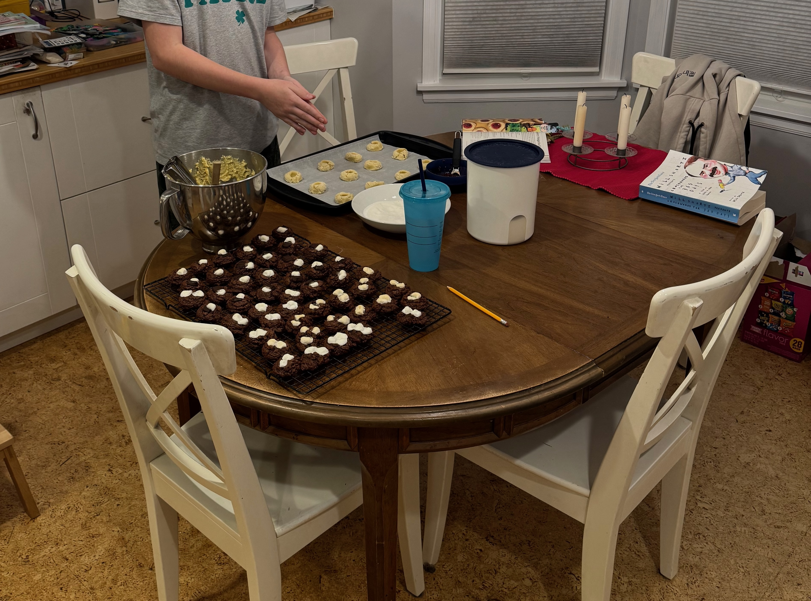
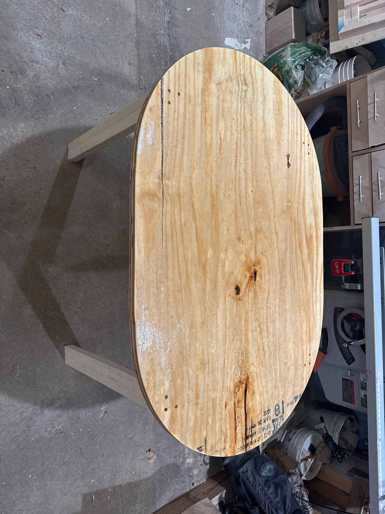
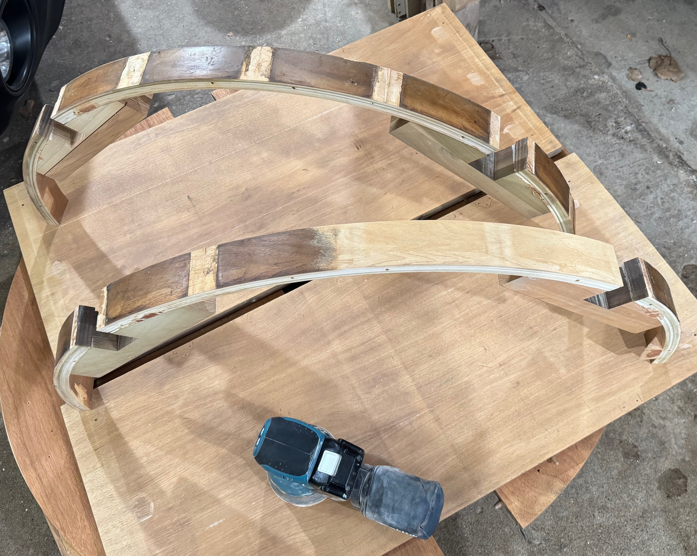
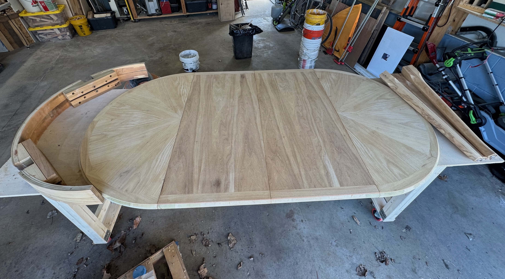
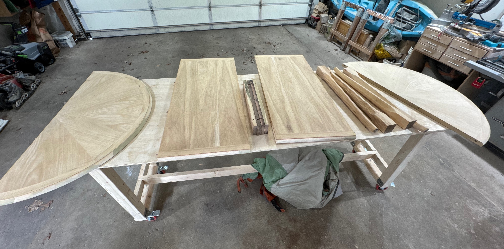
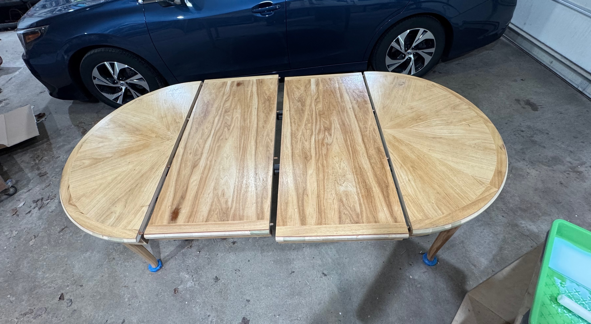
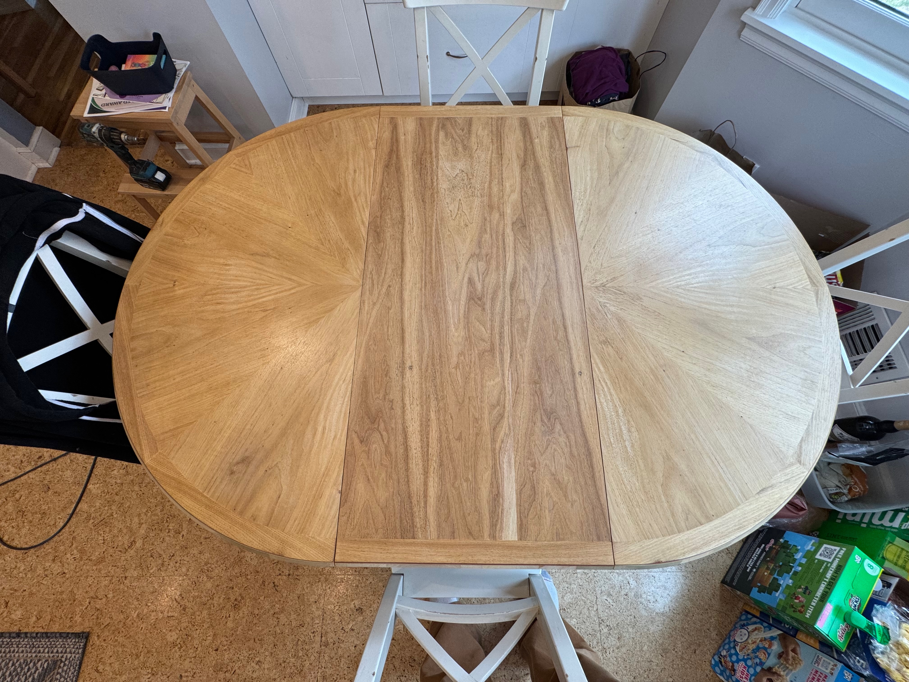
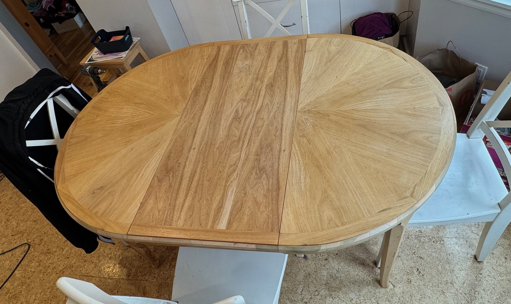

Our dining table is the same one that my grandparents had at their house when I was growing up (and quite a few years before I was born).  It's been a great table and expands from a 42" circle all the way to 82" after adding the leaves.  However it is now something like 60 years old and had definitely started to show its age.  On top of dings and dents the finish had started to get tacky and things would stick to it.  

## Temporary Table

While I hoped the stripping and refinishing process was going to be pretty quick I've done enough projects to know estimates are a joke and it inevitably would take two or three times as long as I planned.  Since this is our only proper dining space and we use it for breakfast pretty much every day I figured I should whip up a quick temporary table.  Perhaps I overdid it but I just figured if I made a temporary table then the project would go quickly and if I threw a board on some sawhorses it would end up taking months.  

## Breaking it Down

Started with just pulling it all apart taking off the apron and hardware.

The apron had some very dated decorative trim on it that had accumulated a lot of grime over the years and also had started cracking off.  Rather than trying to patch it and strip it I decided to just remove it entirely.  Cleans the lines up a bit and simplified the refinishing process quite a bit.  

There were a few spots (no pictures, sorry) where the apron cracked that I just had to patch with woodfiller.  I could've re-veneered it but that seemed like overkill and wouldn't have matched anyway.  

## Stripping and Sanding

Once I had it all broken down, the apron details removed, and cracks patched it was time for getting rid of that old finish.  I used a bunch of [Citristrip](https://citristrip.com/) as the first couple rounds of removing all that finish and grime.  Once that was scraped off I got going on sanding using 60, 120, and 220 grit as things progressed.  The color change is pretty dramatic!

As things progressed I also used my [Rockler Circle Cutting Jig](https://www.rockler.com/rockler-circle-cutting-jig) to remove the dated [ogee profile](https://en.wikipedia.org/wiki/Ogee) on the ends and just ripped it off with a circular saw for the leaves.  Then it was just sanding, sanding, sanding!

## Finished Up

After the sanding was finally done it was time for finishing it up.  After some color and finish testing trials I landed on [Water-based Varathane Polyurethane](https://varathanestain.com/varathane-water-based-polyurethane/).  Offered a nice easy application process and kept the table from ending up too yellow.

Once that was all applied, sanded, and dried it was time to get it put back into the kitchen!  Looks pretty great I think although now I want to redo the floors as it kind of blends in a bit too much.  Oh well, that's for another day!

